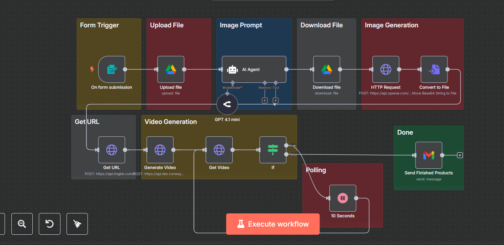

# 🎬 AI Product Video Generator – n8n Workflow

This project is an end-to-end automated product video generator built using n8n, OpenAI, RunwayML, and other APIs. It takes a product file as input (e.g., image or description), generates an AI-enhanced prompt, creates visuals using OpenAI, converts them into videos using RunwayML, and delivers the result via Gmail — all without manual effort.

---

## 🔧 Stack

- ⚙️ n8n – visual automation engine
- 🤖 OpenAI (GPT-4.1 mini) – for prompt generation
- 🎨 OpenAI Image API – for DALL·E-style image creation
- 🎥 RunwayML API – for video rendering
- ☁️ Google Drive – for file upload/download
- 🌐 Imgbb API – image hosting
- 📧 Gmail – for final product delivery

---

## 🔄 Workflow Steps

1. 📝 Form Trigger  
   User submits product data via a form.

2. 📁 Upload to Google Drive  
   Input file is stored in Google Drive.

3. 🤖 Prompt Generation  
   An AI Agent generates a descriptive prompt from the uploaded file.

4. 🎨 Image Generation  
   The prompt is passed to OpenAI’s image generation API to create visuals.

5. 🔗 Get Image URL  
   The image is uploaded to imgbb to get a public URL.

6. 🎥 Video Generation (RunwayML)  
   The URL is passed to RunwayML API to generate a promotional video.

7. ⏳ Polling  
   The system checks until video rendering is complete.

8. 📬 Email Delivery  
   Final video is sent to the user via Gmail.

---

## 🧠 Use Cases

- Auto-generate Instagram Reels for eCommerce
- Product listing videos for online marketplaces
- Real estate: turn photos into mini video tours
- Video generation from a CSV of SKUs

---

## 📸 Workflow Diagram

---

## 🧪 Sample Output

> Input: Image + Description of a sports watch  
> Output: 10-second AI-rendered video with branded animation and visuals, delivered via email.

---
